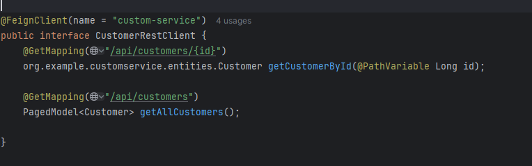

<h3>c'est la base de donnée de la microservice customer crée pour gérer les client </h3>

<h3>c'est la base de donnée de la microservice inventory crée pour gérer les produits </h3>

<h3>Le Gateway agit comme un point d'entrée centralisé  son objectif est de recevoire les requetes HTTp pour déterminer dans quel microservice va consulter ,avant d'aller en vers un microservice il prends le header et la date(before/after/between) et il corrige le path avant de rediriger envers le microservice </h3>

<h4>le service discovery nous avons déclaré les microservice qui se démarrent</4>
<h4>Avec le discovery activé, le Gateway ne dépend plus de configurations statiques</4>
<h4>Le Gateway ne dépend plus des adresses http://localhost:8082 ou http://localhost:8083. Il demande directement à Eureka où se trouvent les services (CUSTOMER-SERVICE, BILLING-SERVICE, etc</4>
<h4>Le discovery permet au Gateway de trouver dynamiquement les microservices via un registre (comme Eureka).
Cela évite d'avoir des adresses statiques</4>

<h4>dans l'image ci-après donc après la configuration des adresse seront dynamique et au lieu d'indiquer comme "http://localhost:NumeroPort" le Gate-way demande directement à Eureka où se trouvent les noms des services (CUSTOMER-SERVICE, BILLING-SERVICE,INVENTORY-SERVICE)</4>

<h4>dans l'image ci-après le Feign package dont le role est de faciliter la communication entre les Microservices (CUSTOMER-SERVICE, BILLING-SERVICE,INVENTORY-SERVICE)</4>

<h4>c'est une base de donnée creé dans h2 sql pour gérer la facturation qui va contenir  les production et chaque produit(inventory) avec son customer(client) /4>

<h4>c'est un api applé par le discovery service pour retourner une facture d'un produit par son id sous format json) /4>

